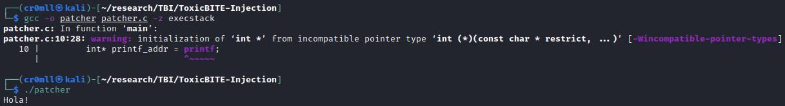
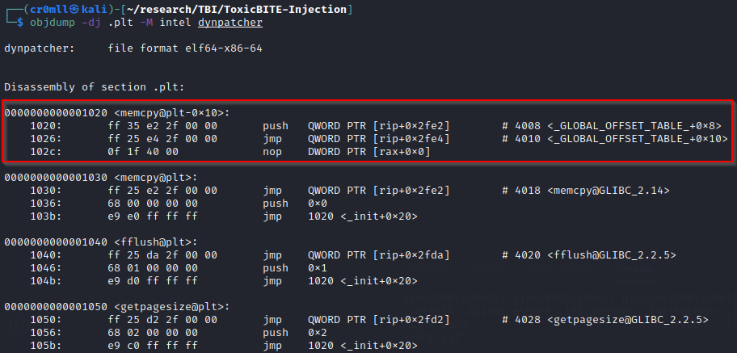

# Introduction
Shellcode is a tool widely used in the exploitation stage of numerous red team engagements and penetration tests. In this paper, we demonstrate the usefulness of shellcode in a C2 infrastructure at the post-exploitation level by availing ourselves of a novel technique - ToxicBITE Injection - in order to achieve complete runtime polymorphism of our shellcode, in addition to inhibiting attempts at static analysis by the blue team.

This form of attack allows an APT to inject malicious code into a C2 payload at runtime and execute it without loading any additional shared libraries. We will demonstrate how a determined adversary can freely call external procedures from shellcode on the stack, pass arguments to those functions, and alter the shellcode on the fly.

# Invoking Predefined Procedures from Shellcode
We will use the following short program as an example (hello.c):

```cpp
#include <stdio.h>

int main(void)
{
	printf("Hola!");
}
```
Compiling this code, results in the following assembly shellcode:
“\x48\x83\xec\x08\x48\x8d\x3d\xa9\x0f\x00\x00\x31\xc0\xe8\xce\xff\xff\xff\x31\xc0\x48\x83\xc4\x08\xc3\x0f\x1f\x80\x00\x00\x00\x00”. The highlighted part is the call instruction which invokes the printf function. We will need to modify it in order to link to the proper printf procedure when we actually execute this shellcode in another payload.

The AMD64 architecture supports numerous addressing modes, but, for the sake of simplicity, here we will stick to direct addressing which means we will actually use a different call instruction altogether - one which jumps to the address inside of the specified register. If we are to achieve this, we will need to put the correct address into our register of choice and then use the correct call instruction with the appropriate operand. For our intents and purposes, rax will be used. We shall now alter the above shellcode with the new call instruction, the bytes of which are “\xff\xd0” - these translate to call rax.

We also need to populate the rax register with the appropriate address beforehand. We can do this by inserting the following instruction before the call “\x48\xB8\x00\x00\x00\x00\x00\x00\x00\x00”, which translates to movabs rax, value. You might notice that there are a lot of null bytes. These constitute the address we want to insert into rax and we will later need to replace them with the address of the function we want to call. Thus far, we have the following shellcode

“\x48\x83\xec\x08\x48\x8d\x3d\xa9\x0f\x00\x00\x31\xc0 **\x48\xB8\x00\x00\x00\x00\x00\x00\x00\x00** **\xff\xd0** \x31\xc0\x48\x83\xc4\x08\xc3\x0f\x1f\x80\x00\x00\x00\x00”, where the in bold are the modified bytes.

We set our goal on invoking the printf function with the “Hola!” argument. To accomplish this, we need to store this string somewhere and then populate the rdi register with the address of the argument. As you will later see, I have decided to store the string in a separate data buffer, which you can further divide into an input and an output buffer as your shellcode gets more complex. The instruction to populate the rdi register consists of the bytes “\x48\xBF\x00\x00\x00\x00\x00\x00\x00\x00\”. Again, the null bytes will have to be replaced by our payload executing the shellcode, which is now semi-complete (yellow denotes the newly inserted bytes): 

“\x48\x83\xec\x08\x48\x8d\x3d\xa9\x0f\x00\x00\x31\xc0 **\x48\xBF\x00\x00\x00\x00\x00\x00\x00\x00** \x48\xB8\x00\x00\x00\x00\x00\x00\x00\x00\xff\xd0\x31\xc0\x48\x83\xc4\x08\xc3\x0f\x1f\x80\x00\x00\x00\x00”

All that’s left is building a sample payload as a proof-of-concept.

## Building a Payload
We will make use of the following code as our payload and break it down:
```cpp
#include <stdio.h>
#include <string.h>

int main(void)
{
	char execBuf[1024] = "\x48\x83\xec\x08\x48\x8d\x3d\xa9\x0f\x00\x00\x31\xc0\x48\xBF\x00\x00\x00\x00\x00\x00\x00\x00\x48\xB8\x00\x00\x00\x00\x00\x00\x00\x00\xff\xd0\x31\xc0\x48\x83\xc4\x08\xc3\x0f\x1f\x80\x00\x00\x00\x00";
	
	char dataBuf[128] = "Hola!\x00";
	
	int* printf_addr = (int*)printf;
	char* dataBuf_addr = dataBuf;
	memcpy(&execBuf[15], &dataBuf_addr, 6); // populate rdi
	memcpy(&execBuf[25], &printf_addr, 8); // populate rax
	
	((void (*)(void))execBuf)();
	fflush( stdout );
}
```
We begin by initialising our two buffers - the execute buffer with the shellcode and the data buffer with the string.

On the next lines, the address of printf is acquired and is then copied into the movabs rax, value instruction, replacing the null bytes. Exactly the same occurs with the instruction that populates the rdi register, only this time with the address of the string we want to print. Compiling this simple program and running it results in what we would expect - a warning (which we will kindly ignore) and… “Hola!”



Function execution from shellcode is successful! Now, we can all agree that this isn’t very useful, since we can only call printf and can only do so with a single argument. This can, however, be expanded upon, as we will now show. It is possible to choose and execute which function to invoke at runtime without the need to hardcode its address into the payload. This is achievable through the *_dl_resolve* function.

# Dynamic Linking and _dl_resolve

Dynamic linking permits any libraries to be loaded in at runtime, instead of being incorporated into an executable at compile-time. This saves a drastic amount of disk space at the cost of significantly complicating the linking process. The dynamic linker has to go through the instructions and fix any calls to external functions after the required libraries have been mapped into the running executable. Additionally, the default behaviour is the so-called lazy loading whereby function addresses aren’t even resolved until the first time a procedure is invoked (although this can be overridden when compiling the executable). 

When a function from a dynamic library is called, the call instruction always, no matter if it’s the first call, jumps to somewhere in an executable section of the ELF file called the Procedure Linking Table (PLT). All entries in this table are of a fixed length and each corresponds to a particular function. The initial element (PLT0) is a bit different in that it contains two instructions - the first one pushes the address of the link map (a structure containing a list of the shared libraries referenced by the executable) to the stack and the second instruction jumps to _dl_runtime_resolve, which takes two parameters - the link map and a relocation argument.



When a PLT entry, other than the first one, is executed, it first jumps to the address contained in the corresponding part of the Global Offset Table (GOT). When the function hasn’t been called before, this address will point to the next instruction in the respective PLT entry - in the case of memcpy this is the instruction at address 1036. This instruction pushes the offset from the beginning of the relocation table at which the entry which should contain the appropriate address for the invoked function should reside. This is also the relocation argument we mentioned earlier. If the procedure has been previously invoked, its address will already be stored in the corresponding GOT entry and so the first instruction in the PLT entry will directly jump to the function at hand. The last instruction of every function’s PLT section just hands off execution to PLT0.

