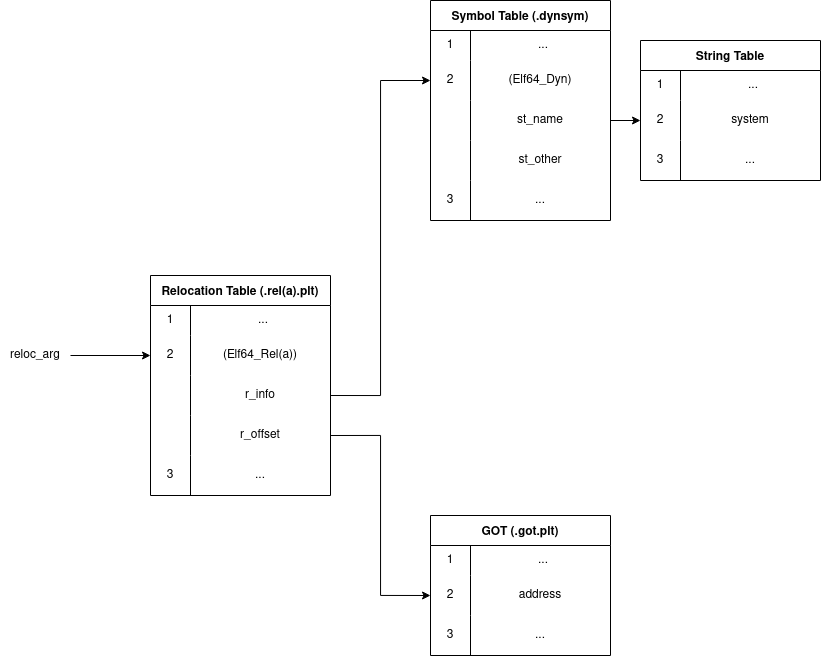

# Introduction
Shellcode is a tool widely used in the exploitation stage of numerous red team engagements and penetration tests. In this paper, we demonstrate the usefulness of shellcode in a C2 infrastructure at the post-exploitation level by availing ourselves of a novel technique - ToxicBITE Injection - in order to achieve complete runtime polymorphism of our shellcode, in addition to inhibiting attempts at static analysis by the blue team.

This form of attack allows an APT to inject malicious code into a C2 payload at runtime and execute it without loading any additional shared libraries. We will demonstrate how a determined adversary can freely call external procedures from shellcode on the stack, pass arguments to those functions, and alter the shellcode on the fly.

# Invoking Predefined Procedures from Shellcode
We will use the following short program as an example (hello.c):

```cpp
#include <stdio.h>

int main(void)
{
	printf("Hola!");
}
```
Compiling this code, results in the following assembly shellcode:
“\x48\x83\xec\x08\x48\x8d\x3d\xa9\x0f\x00\x00\x31\xc0\xe8\xce\xff\xff\xff\x31\xc0\x48\x83\xc4\x08\xc3\x0f\x1f\x80\x00\x00\x00\x00”. The highlighted part is the call instruction which invokes the printf function. We will need to modify it in order to link to the proper printf procedure when we actually execute this shellcode in another payload.

The AMD64 architecture supports numerous addressing modes, but, for the sake of simplicity, here we will stick to direct addressing which means we will actually use a different call instruction altogether - one which jumps to the address inside of the specified register. If we are to achieve this, we will need to put the correct address into our register of choice and then use the correct call instruction with the appropriate operand. For our intents and purposes, rax will be used. We shall now alter the above shellcode with the new call instruction, the bytes of which are “\xff\xd0” - these translate to call rax.

We also need to populate the rax register with the appropriate address beforehand. We can do this by inserting the following instruction before the call “\x48\xB8\x00\x00\x00\x00\x00\x00\x00\x00”, which translates to movabs rax, value. You might notice that there are a lot of null bytes. These constitute the address we want to insert into rax and we will later need to replace them with the address of the function we want to call. Thus far, we have the following shellcode

“\x48\x83\xec\x08\x48\x8d\x3d\xa9\x0f\x00\x00\x31\xc0 **\x48\xB8\x00\x00\x00\x00\x00\x00\x00\x00** **\xff\xd0** \x31\xc0\x48\x83\xc4\x08\xc3\x0f\x1f\x80\x00\x00\x00\x00”, where the in bold are the modified bytes.

We set our goal on invoking the printf function with the “Hola!” argument. To accomplish this, we need to store this string somewhere and then populate the rdi register with the address of the argument. As you will later see, I have decided to store the string in a separate data buffer, which you can further divide into an input and an output buffer as your shellcode gets more complex. The instruction to populate the rdi register consists of the bytes “\x48\xBF\x00\x00\x00\x00\x00\x00\x00\x00\”. Again, the null bytes will have to be replaced by our payload executing the shellcode, which is now semi-complete (yellow denotes the newly inserted bytes): 

“\x48\x83\xec\x08\x48\x8d\x3d\xa9\x0f\x00\x00\x31\xc0 **\x48\xBF\x00\x00\x00\x00\x00\x00\x00\x00** \x48\xB8\x00\x00\x00\x00\x00\x00\x00\x00\xff\xd0\x31\xc0\x48\x83\xc4\x08\xc3\x0f\x1f\x80\x00\x00\x00\x00”

All that’s left is building a sample payload as a proof-of-concept.

## Building a Payload
We will make use of the following code as our payload and break it down:
```cpp
#include <stdio.h>
#include <string.h>

int main(void)
{
	char execBuf[1024] = "\x48\x83\xec\x08\x48\x8d\x3d\xa9\x0f\x00\x00\x31\xc0\x48\xBF\x00\x00\x00\x00\x00\x00\x00\x00\x48\xB8\x00\x00\x00\x00\x00\x00\x00\x00\xff\xd0\x31\xc0\x48\x83\xc4\x08\xc3\x0f\x1f\x80\x00\x00\x00\x00";
	
	char dataBuf[128] = "Hola!\x00";
	
	int* printf_addr = (int*)printf;
	char* dataBuf_addr = dataBuf;
	memcpy(&execBuf[15], &dataBuf_addr, 6); // populate rdi
	memcpy(&execBuf[25], &printf_addr, 8); // populate rax
	
	((void (*)(void))execBuf)();
	fflush( stdout );
}
```
We begin by initialising our two buffers - the execute buffer with the shellcode and the data buffer with the string.

On the next lines, the address of printf is acquired and is then copied into the movabs rax, value instruction, replacing the null bytes. Exactly the same occurs with the instruction that populates the rdi register, only this time with the address of the string we want to print. Compiling this simple program and running it results in what we would expect - a warning (which we will kindly ignore) and… “Hola!”


Function execution from shellcode is successful! Now, we can all agree that this isn’t very useful, since we can only call printf and can only do so with a single argument. This can, however, be expanded upon, as we will now show. It is possible to choose and execute which function to invoke at runtime without the need to hardcode its address into the payload. This is achievable through the `_dl_resolve` function.

# Dynamic Linking and _dl_resolve

Dynamic linking permits any libraries to be loaded in at runtime, instead of being incorporated into an executable at compile-time. This saves a drastic amount of disk space at the cost of significantly complicating the linking process. The dynamic linker has to go through the instructions and fix any calls to external functions after the required libraries have been mapped into the running executable. Additionally, the default behaviour is the so-called lazy loading whereby function addresses aren’t even resolved until the first time a procedure is invoked (although this can be overridden when compiling the executable). 

When a function from a dynamic library is called, the call instruction always, no matter if it’s the first call, jumps to somewhere in an executable section of the ELF file called the Procedure Linking Table (PLT). All entries in this table are of a fixed length and each corresponds to a particular function. The initial element (PLT0) is a bit different in that it contains two instructions - the first one pushes the address of the link map (a structure containing a list of the shared libraries referenced by the executable) to the stack and the second instruction jumps to _dl_runtime_resolve, which takes two parameters - the link map and a relocation argument.


When a PLT entry, other than the first one, is executed, it first jumps to the address contained in the corresponding part of the Global Offset Table (GOT). When the function hasn’t been called before, this address will point to the next instruction in the respective PLT entry - in the case of memcpy this is the instruction at address 1036. This instruction pushes the offset from the beginning of the relocation table at which relocation information about this particular symbol is located. This is also the relocation argument we mentioned earlier. If the procedure has been previously invoked, its address will already be stored in the corresponding GOT entry and so the first instruction in the PLT entry will directly jump to the function at hand. The last instruction of every function’s PLT section just hands off execution to PLT0.

The relocation table of an executable is an array of either `Elf64_Rel` or `Elf64_Rela` structures (for x64). These are defined as follows:

```cpp
typedef struct {
        Elf64_Addr      r_offset;
        Elf64_Xword     r_info;
} Elf64_Rel;
 
typedef struct {
        Elf64_Addr      r_offset;
        Elf64_Xword     r_info;
        Elf64_Sxword    r_addend;
} Elf64_Rela;
```

`r_offset` is used by `_dl_runtime_resolve` to place the function's address at the appropriate entry of the GOT. It is an offset relative to the start of the binary (the ELF header).
`r_info` is a field which is manipulated through a couple of macros in order to give us the index of the appropriate symbol in the symbol table (`.dynsym`) as well as tell us the type of relocation. These macros are defined like the following:

```cpp
#define ELF32_R_SYM(info)             ((info)>>8)
#define ELF32_R_TYPE(info)            ((unsigned char)(info))
#define ELF32_R_INFO(sym, type)       (((sym)<<8)+(unsigned char)(type))

#define ELF64_R_SYM(info)             ((info)>>32)
#define ELF64_R_TYPE(info)            ((Elf64_Word)(info))
#define ELF64_R_INFO(sym, type)       (((Elf64_Xword)(sym)<<32)+ \ 
                                        (Elf64_Xword)(type))
```

The dynamic symbol table (`.dynsym`) is an array of `Elf64_Sym` structures (for x64) which are comprised of the following:

```cpp
typedef struct {
        Elf64_Word      st_name;
        unsigned char   st_info;
        unsigned char   st_other;
        Elf64_Half      st_shndx;
        Elf64_Addr      st_value;
        Elf64_Xword     st_size;
} Elf64_Sym;
```

For our purposes, the important fields are `st_name` and `st_other`. The first contains an offset from the beginning of the string table which stores a null-terminated string with the name of the symbol. Due to some checks that `_dl_resolve` performs, we will need `st_other` to be equal to 0.

The string table is an array of null-terminated strings containing the names of the symbols in the executable.

## _dl_resolve
When PLT0 hands off execution to `_dl_resolve`, the function will be called with the link map (pushed on the stack by PLT0) and the relocation argument (`reloc_arg`) which was pushed onto the stack by the respective PLT entry. You will notice that `_dl_resolve` takes its arguments directly from the stack. This is because once `_dl_resolve` finds the address of the requested symbol, it will invoke the procedure in addition to placing its address in the GOT. This means that we can still use the registers in order to provide arguments to the requested function.

### How _dl_resolve works
`_dl_resolve` on its own is a simple wrapper around several other functions, but we will not be discussing at length what each of these procedures does, only the general flow of the process. Initially, the relocation argument is used in order to locate the appropriate entry in the relocation table of the executable. The `r_info` member of this entry is then used to find the corresponding element in the dynamic symbol table. From there, `st_name` is utilised to pinpoint the location of the name of the function in the string table. Subsequently, `_dl_resolve` avails itself of this string in order to look it up in the code of the library. Once the address is found, `r_offset` is used to locate where in the GOT it should be placed (note that despite its use, `r_offset` is actually an offset from the beginning of the ELF header). The function initially invoked is also called with any arguments which were provided to it. It looks something like this:



# ToxicBITE-Injection
The code in this section is contained within the `dynpatcher.cpp` file and, for the sake of simplicity, should be compiled with `-z execstack`.

## The exploit
It is possible to use `_dl_resolve` to call any external function by creating a fake relocation table, symbol table, string table, and GOT. `_dl_resolve` performs no upper boundary checks on the relocation argument, which means that we can make it arbitrarily large and thus point to our fake relocation table. From there we can do the same with the rest of the offsets. It does, however, check a few other things which we will need to work around. 

Because of the checks that `_dl_resolve` performs, the relocation argument must be divisible by 0x18 (or 24 in decimal). The distance between the real symbol table and our fake one must be divisible by 0x18 and fit into 32 bits after this division. This practically prevents us from using the stack to store our fake tables and we will need to utilise the `.bss` section, which is closer to the real symbol table in the executable. Additionally, `r_info` must end on a 0x7.

We require the address of the ELF header. Since it is always at the beginning of the binary and is page aligned, we can take the address of an arbitrary local function, align it to a page and then subtract from it the page size until this address points to the magic bytes "\x7FELF". Subsequently, the real relocation, string, global offset, and symbol tables must be located. This is achievable through the `_DYNAMIC` symbol defined in `sys/link.h`. It is also possible to find the dynamic section manually and an example function for that is provided in the C++ file. 

Due to the size restriction on the distance between the real and fake symbol tables, the latter needs to be defined as static and global (to ensure it's placed in the `.bss` section). Additionally, this distance and the relocation argument have to be divisible by 0x18 and because we can't ensure that this will be the case, once we have calculated them, we need to align them to the nearest multiple of 0x18 and relocate the fake relocation and symbol tables to `RealRelocationTable + aligned_reloc_arg` and `RealSymbolTable + aligned_distance`, respectively. 

For the sake of simplicity, all of the fake tables will only contain one entry. Once we have the fake symbol table set up, we need to set `st_info` to 0 and `st_name` to the distance between the real string table and our fake one, which can in this case be a single null-terminated string. Next, `r_info` must be populated with `(( RealToFakeSymbolTableOffset / 0x18 ) << 32 ) | 0x7`, where `RealToFakeSymbolTableOffset` is the 0x18 aligned distance between our fake and real symbol tables. Do not worry about all the bit-wise operations - these are taken care of by a few macros in `_dl_resolve`. `r_offset` on the other hand, must contain the distance between our fake global offset table and the ELF header.

Since `_dl_resolve` takes the relocation argument directly from the stack, we can't actually use a `call` instruction, for it will push the return address to the stack and, therefore, `_dl_resolve` will end up reading the return address instead of the relocation argument. This minor inconvenience can be easily solved the manual emulation of a `call` instruction by pushing the return address to the stack before pushing the relocation argument and then using a jump instruction to execute PLT0. This way, `_dl_resolve` will take pop the relocation argument off the stack before calling the resolved function and the latter will end up with the appropriate return address (`_dl_resolve` uses a jump in order to hand off execution to the requested procedure). Now, the address of PLT0 isn't directly obtainable, but if we recall that the last instruction of every other PLT section is just a jump to PLT0, we can easily find the address of this last instruction through the GOT entry for a yet unresolved symbol - remember that this will point to the second instruction in the PLT section, so just add the length of this instruction to the address at the GOT - and jump to it.


## Building the Payload


